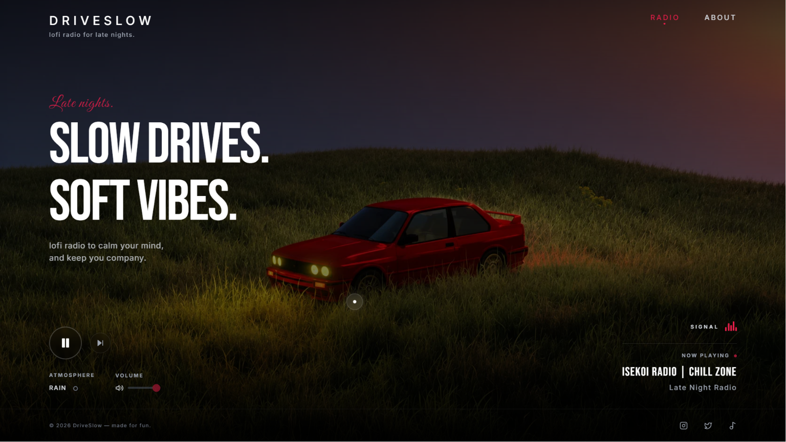
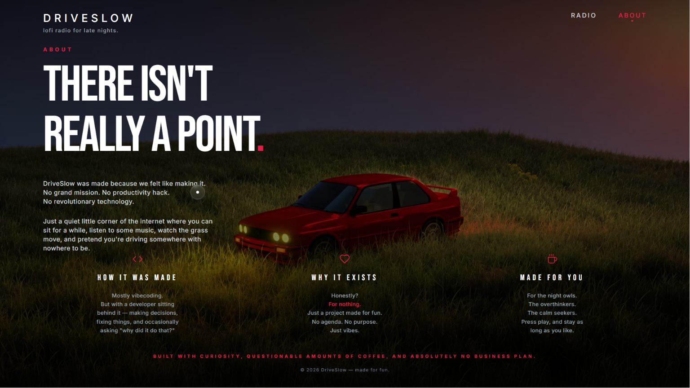

  
   
  
  # DRIVESLOW
  **Lofi radio for late nights. Slow drives. Soft vibes.**

   
  <a href="https://drive-slow-wdij.vercel.app/" target="_blank">Listen Live</a>
   

  

    
    
    
  

 

  DriveSlow is a beautifully minimal 24/7 lofi radio streaming application. 
  It was built with a massive focus on aesthetics, smooth micro-interactions, and creating a calming atmosphere for the night owls and overthinkers.

 

## OVERVIEW

  
    
  

 

## FEATURES

- **Global Audio Persistence**: The music never stops. Built with a custom React Context provider, you can navigate seamlessly between pages without interrupting the radio stream.
- **Hardware-Accelerated Cursor**: Features a custom spring-physics cursor using Framer Motion's `useMotionValue` to completely bypass React render cycles for zero-latency tracking.
- **Media Session API**: Full integration with native OS media controls. Control playback from your keyboard media keys or your phone's lock screen.
- **Atmospheric Effects**: Includes a toggleable CSS-driven rain overlay to set the mood.
- **Intelligent Fallbacks**: Connects dynamically to the RadioBrowser API for live stations, with built-in highly reliable fallback streams if the API drops.
- **State Memory**: Automatically saves your volume preference, mute state, and favorite station to local storage across sessions.

 

## TECH STACK

- **Framework**: [Next.js 14](https://nextjs.org/) (App Router)
- **Styling**: [Tailwind CSS](https://tailwindcss.com/)
- **Animations**: [Framer Motion](https://www.framer.com/motion/)
- **Icons**: [Lucide React](https://lucide.dev/)
- **API**: [Radio Browser API](https://www.radio-browser.info/)

---

  <i>Mostly vibecoding. Built with curiosity, questionable amounts of coffee, and absolutely no business plan.</i>
    
  © 2026 DriveSlow — made for fun.

